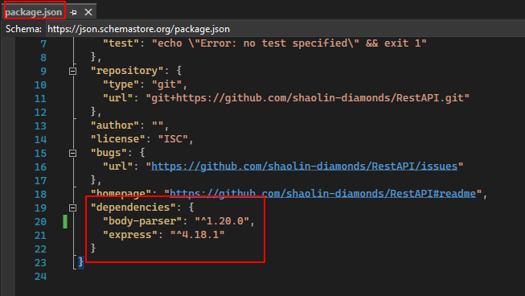

<h1>Rest API</h1>

<h2>Description</h2>
Create a very basic REST API with Node.js (JavaScript), Express, and Postman.
<br />

<h2>Languages and Utilities Used</h2>

- <b>Postman</b>
- <b>Express</b>
- <b>Node.js</b>

<h2>Environments Used </h2>

- <b>Visual Studio 2022</b>

<h2>Program walk-through:</h2>

<p align="center">
<h3>Project initialization:</h3> <br/>
Initialize npm (node package manager) and adds package.json <br/>

<br />
Install npm express and body parser <br/>

<br />

<br />
These installations modify package.json by adding to dependencies <br/>

<br />
<br />
Create index, import modules that were downloaded, and listen on port 3000: <br/>

<br />
<br />
Now have basic structure time to test by running nodemon and using web browser with localhost 3000: <br/>

<br />

</p>

<!--
 ```diff
- text in red
+ text in green
! text in orange
# text in gray
@@ text in purple (and bold)@@
```
--!>
